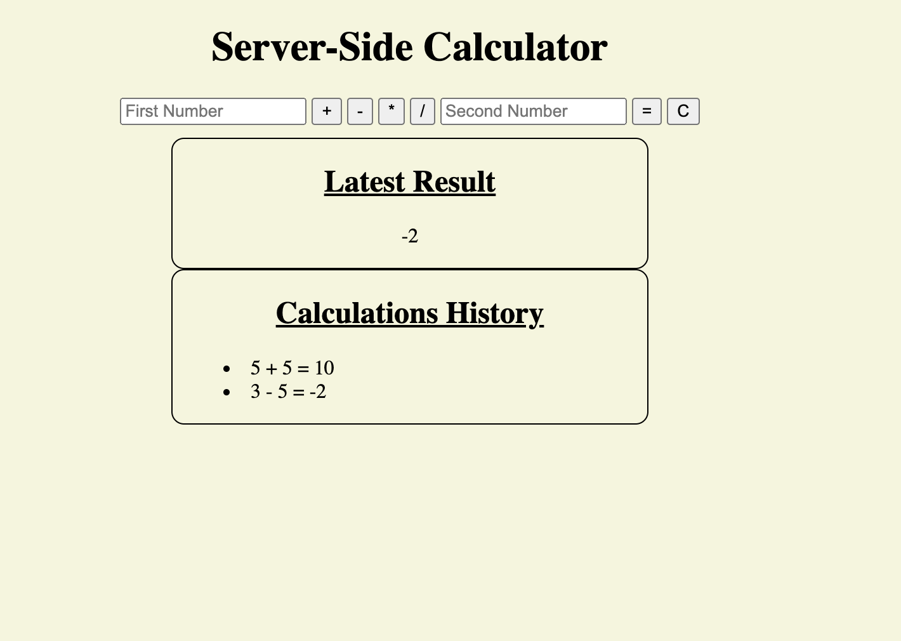

# Server Side Calculator

## Description

_Duration: Weekend Sprint_

This basic server side calculator provides a browser interface to accomplish simple arithmetic using addition, subtraction, muliplication and division. The user will input first number, select an operator, input a second number, and click the equals button (=). Upon completion of these steps the result will be appended to page as well as the history of all calculations made.

## Screen Shot

### Prerequisites

Link to software that is required to install the app.

- [Node.js](https://nodejs.org/en/)

## Installation

1. Clone the repository
2. Open up your editor of choice and run an `npm install`
3. Run `npm start` in your terminal
4. Navigate to localhost:5000 in your 
5. Have fun

## Built With
Front end
- HTML
- CSS
- Ajax/Axios

Back End
- Node.js/Express

## License
[MIT](https://choosealicense.com/licenses/mit/)

_Note, include this only if you have a license file. GitHub will generate one for you if you want!_

## Acknowledgement
Thanks to [Prime Digital Academy](www.primeacademy.io) who equipped and helped me to make this application a reality. (Thank your people)

## Support
If you have suggestions or issues, please email me at [youremail@whatever.com](www.google.com)